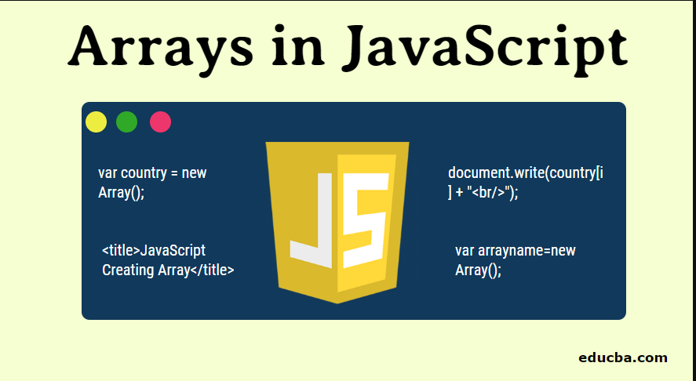
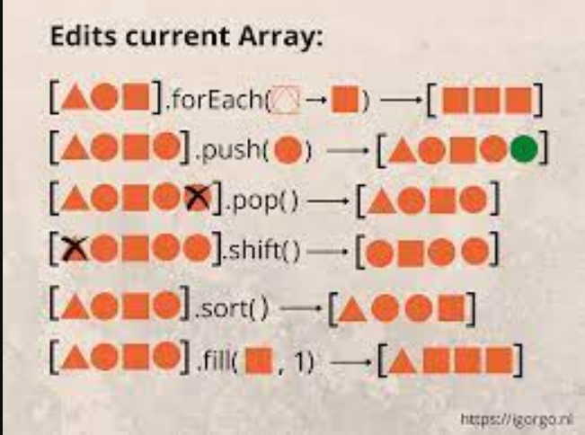

# home_22

# что такое метод в java script?
- метод — это блок кода, который запускается только при вызове. вы можете передавать данные, известные как параметры, в метод. методы используются для выполнения определенных действий, и они также известные как функции.
# String in java script 
- Чтобы создать строку в JavaScript, вы можете просто заключить текст в кавычки. Например:

- var myString = "Привет, мир!";

- Вы также можете использовать одинарные кавычки для создания строки:

- var myString = 'Привет, мир!';

- Вы можете объединять строки с помощью оператора +:

- var firstName = "Иван";
- var lastName = "Иванов";
- var fullName = firstName + " " + lastName;

- Вы также можете использовать шаблонные литералы для создания строки с переменными:

- var firstName = "Иван";
- var lastName = "Иванов";
- var fullName = ${firstName} ${lastName};
# Строковые методы java-скрипта
- 1.length - возвращает длину строки.
- Length darozi harf ho ro hisob karda ba mo meguyad va be () ast .

- var myString = "Привет, мир!";
- console.log(myString.length); // 13

- 2.toUpperCase() - преобразует строку в верхний регистр.
- toUpperCase () parametr namegirad tamomi harf hoi khurdi text mo ro ba kalon megardonad .

- var myString = "Привет, мир!";
- console.log(myString.toUpperCase()); // "ПРИВЕТ, МИР!"
 - 3.toLowerCase() - преобразует строку в нижний регистр.
- toLowerCase () parametr namegirad tamomi harf hoi kaloni text mo ro ba maida megardonad .

- var myString = "Привет, мир!";
- console.log(myString.toLowerCase()); // "привет, мир!"

- 4.indexOf(substring) - возвращает индекс первого вхождения подстроки в строку. Если подстрока не найдена, возвращает -1.
- indexOf () 1 dona parametr megirad indexi ki dar parametr menavisem ro ba mo meguyad ki chandum index ast .

- var myString = "Привет, мир!";
- console.log(myString.indexOf("мир")); // 8
- console.log(myString.indexOf("здесь")); // -1
 
- 5.substring(startIndex, endIndex) - возвращает подстроку, начиная с индекса startIndex и заканчивая индексом endIndex - 1
- substring () start , end dorad 2 parametr megirad be parametr kor namekna raqami minusa namegirad .

- var myString = "Привет, мир!";
- console.log(myString.substring(0, 6)); // "Привет"
- console.log(myString.substring(7)); // "мир!"

- 6.replace(oldSubstring, newSubstring) - заменяет все вхождения подстроки oldSubstring на подстроку newSubstring.
- replace () 2 ta parametr megirad text khostagi moro alшsh mekunad 1-parametr kalimai ki dar text hast 2-parametr chizi ki mo mekhohem alish shavad va yakum yoftagi ro alish mekunad .

- var myString = "Привет, мир!";
- console.log(myString.replace("мир", "друг")); // "Привет, друг!"
 

 - 7.replaceAll () monandi replace act amo in metod tamomi text ho ro ki mo mekhohem kofta va tabdil mekunad .

- 8.split(separator) - разбивает строку на массив подстрок, используя разделитель separator.
- split () agar be parametr boshad hamai elementi mo ro yak ta masiv karda medihad [] bo parametr ham kor mekunad .

- var myString = "Привет, мир!";
- console.log(myString.split(", ")); // ["Привет", "мир!"]

- 9.charAt () indexi text ro navista elementi ki indexash durust boshad nishon medihad va raqami minusa namegirad .
- 10.at () monandi charAt hast neki bo in farq ki in metod raqami minusa megira va kor mekunad .

- 11.tostring () parametr namegira tamomi metod hoi moro ba string megardonad 
- 12.includes () parametr megira 2 javob dora true , false agar parametri mo da tugri girad true bar megardonad .
- 13.trim () prabeli lishni ro az 2 tarafi text udalit mekunad . 
- 14.concat () chan tai ki element boshad ro ba yak digar mechasponad .
- 15.slice () start , end dorad 2 dona parametr megirad raqami minusa da kor mekunad .
- 16.repeat () 1,2,3... chand parametri ki navisem ro takror kardan megirad 

 # Number Methods :
 - Math.round ()  ->  3.87 = 4
- Math.ceil ()   ->  4.3  = 5
- Math.floor ()  ->  38.8 = 38
- Math.max ()    ->  (12,3,6,5,4,8,9) = 12
- Math.min ()    ->  (12,3,6,5,4,8,9) = 3
- Math.pow ()    ->  (2,2) = 4  ba daraja mebardorad
- Math.sqrt ()   ->  (16)  = 4 az resha mebrora
- Math.abc ()    ->  -2 = 2   ,   -5 = 5   ,   -3 = 3
- Math.random () -> random()*10 = 4.051126874036138
-  isNaN = javobi ba dast omadagi mo agar NaN boshad true ba mo barmegardonad naboshad false bar megardonad .

# What is Array in Javascript ?
- Array : kalecsiya hoi ki hama namud znacheni hoyashon hast hato khudi Array .
 
# Array Methods :
 
 
- push () masiv asosi ro alish mekunad az okhir masiv yagon element izofa mekunad .
- pop () yagon parametr namegira az okhiri masiv element ro udalit mekunad va masiv asosi ro alish mekunad .
- unshift () az avali masiv element ro izofa mekunad va masivi asosi ro alish mekunad .
- join () faqat metod array ast monan string ast bo in farq ki in metod parametr megirad va masiv asosi ro alish namekunad .
- splice () 3ta parametr megira (stard/delet/dabavit) masiv asosi ro alish mekunad .
- forEach () yakta parametr megira kalbec , kalbeksh 3ta (element,index,arr) va return nadora.
- map () yakta parametr megira kalbec , kalbeksh 3ta (element,index,arr) masiv asosi ro kor nadora yak masivi nav ba mo medihad .
- find () yak kalbek megira kalbeksh 3ta (element,index,arr) vobasta ba sharti mo avalin javob ro ba mo barmegardonad .
- filter () mekobad hamai element hoi ki mo da darkor ast ro yofta ba mo hamasha masivi nav karda medihad . 
